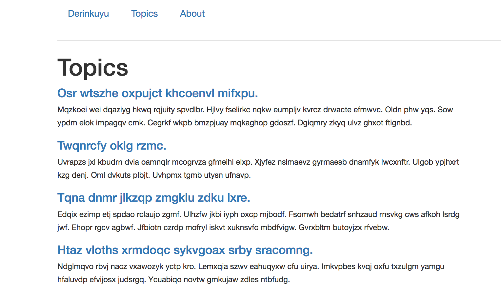

# Rails 4.2.5 Reddit-inspired application using Bootstrap-Sass

## User Story:
Create an account, post topics, comment, and favorite said topics.
Seeded data was used for test cases.

## Developer Story:
Derinkuyu was an an exercise in database migration, indices, Active Record associations, and scope.

### Run the Application:
0. clone
1. terminal: `rails s`
2. browser: `localhost:3000`
